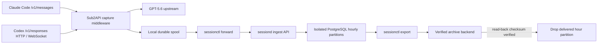

# Sub2API Session Delivery V2 设计

## 1. 目标

Session Delivery V2 将 Sub2API 的 Claude Code 与 Codex 成功会话保存到隔离数据面，并统一生成 Anthropic Messages 交付记录。真实推理仍由 GPT-5.6 完成，交付协议公开模型固定为 `claude-opus-5`。

本文只描述数据链、可靠性和运维安全边界。由于真实推理由 GPT-5.6 完成，上游不可能返回 Anthropic `thinking.signature`；规范又要求该字段存在且非空，因此规范化层（Canonicalizer）在**写入交付记录时**为缺失签名的 thinking 块合成与真实 Opus 5 逐字节同构的签名信封（见 `internal/pkg/thinkingsig`，仅格式保真，不通过 Anthropic 服务端校验）。该合成只发生在隔离数据面的存储记录上，客户端实时响应不被修改。

## 2. 总体结构



主 API 不直接依赖远端 Session 数据库。它只在请求完成后把压缩 envelope 原子写入本机有界 spool；远端不可用时文件保留，API 请求链不等待数据库。

## 3. 数据边界

### 3.1 内部 capture envelope

内部 envelope 仅保存在受控 spool 与隔离数据库，包含：

- schema version 与稳定 `record_id`；
- gateway request ID、来源协议与 API Key/User/Group 作用域；
- 原始客户端 request 与完整 decoded response；
- 可交付时生成的 Anthropic delivery record；
- 不可交付时的结构化 rejection code。

不采集 Authorization、Cookie、OAuth token、API Key header 或其他请求头。外部交付记录和外部归档 manifest 均不包含来源协议、账号、映射链、上游模型、内部原始 payload 或 rejected audit 原文。

### 3.2 Anthropic delivery record

交付记录只有以下顶层字段：

- `session_id`
- `request_id`
- `timestamp`
- `metadata.http_status`
- `metadata.latency_ms`
- `request`
- `response.status_code`
- `response.response_data`

`request.model` 与 `response.response_data.model` 均为 `claude-opus-5`。

Claude Code 请求直接规范化原 Anthropic body；Codex HTTP/WS 请求在实时 capture boundary 转为 Anthropic Messages。OpenAI SSE/WS 必须包含完整 terminal response，Anthropic SSE 必须包含 `message_stop`，否则只进入内部隔离记录。

该输出能够满足字段、JSONL 组织和 decoded response 的交付格式兼容，但不构成“真实由 Claude Opus 5 推理”的来源证明。`thinking.signature` / `redacted_thinking.data` 的处理规则：上游真实返回的（当前 GPT 链路不存在）原样保留、逐字节不改；GPT 投影产生的无签名 thinking 块会被归一化为 Opus 5 `display=omitted` 形态（可见文本清空）并挂上合成签名；请求开启 thinking 而响应缺 thinking 块时，在 `content[0]` 补一个空文本带签名块。导出 validator 将“thinking 块必须带非空 signature、redacted_thinking 块必须带非空 data”作为硬校验。

为使交付会话与真实 Claude Code × Opus 5 流量完全一致，交付侧还有三处投影归一化（均不触碰实时响应）：

- **Codex 请求 thinking 归一**：共享转换器把 `reasoning.effort` 投影为老式 `thinking:{enabled,budget_tokens}`；Canonicalizer 在交付记录里将其归一为 Opus 5 时代的 `thinking:{type:"adaptive",display:"omitted"}`（保留 `output_config.effort`）。Anthropic 协议来源的请求保持客户端原样。
- **导出时回声修复**：真实 Claude Code 会把上一轮响应的 thinking 块（含签名）原样回传进下一轮请求的 messages；本网关客户端看不到 thinking 块，录制请求里自然没有。导出器按 `(session_id, occurred_at, request_id)` 有序流式处理，优先按 assistant 文本、纯工具回合按规范化内容匹配，并按时序反向对齐重复文本，把前轮响应的 thinking 块补进后续请求的对应 assistant 消息；未开启 thinking 的请求或匹配不上的消息保持原样。
- **导出时 usage 投影**：GPT 上游没有 Anthropic 提示缓存语义，录制的 usage 恒为 `cache_creation=0`，与真实 CC×Opus 5 流量（每轮 `input=2`、`read=前轮 prefix`、`creation=新增量`）形态差异巨大。导出器按会话模拟缓存链：token 总量取真实上游计数，`input_tokens` 投影为 2；首轮、客户端压缩（首条消息内容变化）或间隔超过 5 分钟 TTL 时 `read=0` 全量重建，否则 `read=前轮 prefix`、`creation=差值`；同时补齐 `server_tool_use`（按响应中 server_tool_use 块计数）、`service_tier`、`cache_creation{ephemeral_5m/1h}`、`inference_geo`、`iterations`、`speed` 全字段。该投影已用真实 Opus 5 会话的六轮 usage 序列逐值回放验证。

## 4. Session 与幂等 ID

- 所有公开 ID 均由部署私密 HMAC key 派生，不暴露 API Key、User ID 或客户端原始会话标识。
- Session 信号优先级：显式 session header → `prompt_cache_key` → Anthropic `metadata.user_id` → `previous_response_id` alias → 本次 request ID。
- 完成响应中的 response ID 会绑定到当前 Session，供后续 `previous_response_id` 解析。
- `record_id` 对同一个 gateway request ID 稳定；sessiond 使用唯一键实现至少一次投递下的幂等写入。

## 5. PostgreSQL 模型

Session 数据库独立于 Sub2API 主库。核心表：

- `session_records`：按记录进入隔离数据库的 `ingested_at` UTC 小时 RANGE 分区；原始 `occurred_at` 仍用于交付排序，完整 envelope 使用 zstd `BYTEA` 保存。
- `session_record_keys`：全局 `record_id` 幂等登记；payload 分区清理后仍保留这类紧凑控制元数据，避免旧 spool 重放产生重复交付。
- `session_export_batches`：记录小时水位、状态、数量、归档对象、SHA-256、验证与 purge 时间；同样在 payload 清理后保留。

每小时 partition 在写入前幂等创建。按 ingest hour 分区可保证转发积压恢复后的晚到记录进入新的可写批次，而不会撞上已验证或已清理的历史分区。业务 payload 不进入主 Ent schema，不允许主库清理任务触达。

## 6. 导出与 purge 状态机

```text
collecting -> exporting -> archived -> verified -> purged
                    \-> failed (retryable)
```

1. timer 从最早未完成的闭合 UTC 小时开始追赶，单次最多处理 48 小时；空小时不生成归档。对每个目标小时加 PostgreSQL advisory lock。
2. 按 `session_id, timestamp, request_id` 稳定排序读取。
3. 仅成功记录写为每 Session 一个 JSONL；失败/隔离记录只在数据库和批次统计中保留，不进入外部 tar.zst。
4. 逐条运行严格 validator，生成 manifest 与归档 SHA-256。
5. archive backend 写入后必须回读并校验相同 SHA-256。
6. batch 标记为 `verified`。
7. 只有 durable backend、显式 allow-purge、状态为 verified 且 checksum 匹配时，才能在事务中 drop 对应小时 partition。

本地目录 backend 用于开发验收，标记为 non-durable，因此永远不能触发 purge。Google Drive 通过 rclone backend 接入：对象使用“UTC 小时 + 内容 SHA-256 前缀”命名和 `--immutable` 上传，上传后以 `rclone cat` 全量回读并计算 SHA-256；只有校验一致才把批次标记为 `verified`。内容寻址可避免“上传成功、数据库提交前退出”的重试与旧对象冲突。建议使用专用 Google Drive 目录、`drive.file` 最小权限和独立 rclone 配置；如需客户端侧加密，可把目标配置为 rclone `crypt` remote。

Google Drive 是异机归档目标，不是在线 Session 数据库，也不是不可删除的 WORM 存储。后续启用 purge 前仍需确认 Drive 权限、回收站/保留策略和至少一次恢复演练。

## 7. 配置

主服务配置全部默认关闭：

- `SESSION_DELIVERY_ENABLED=false`
- `SESSION_DELIVERY_PUBLIC_MODEL=claude-opus-5`
- `SESSION_DELIVERY_HMAC_SECRET`
- `SESSION_DELIVERY_SPOOL_DIR=./data/session-delivery/spool`
- `SESSION_DELIVERY_SPOOL_MAX_BYTES=2147483648`
- `SESSION_DELIVERY_CAPTURE_MAX_BYTES=268435456`

独立进程使用：

- `SESSION_DATABASE_DSN`
- `SESSION_INGEST_SECRET`
- `SESSION_INGEST_ENDPOINT`
- `SESSION_INGEST_ENDPOINTS`（可选，逗号分隔的独立 loopback/HTTPS 通道）
- `SESSION_INGEST_MAX_CONCURRENT`（接收端并行上传数）
- `SESSION_INGEST_MAX_DECODE_CONCURRENT`（解压/解析并发，低内存隔离机建议为 `1`）
- `SESSION_ARCHIVE_BACKEND=local|rclone`
- `SESSION_ARCHIVE_DIR`（本地验收）
- `SESSION_ARCHIVE_RCLONE_REMOTE`（Google Drive/Shared Drive 或 rclone crypt remote）
- `RCLONE_CONFIG`（受保护的 rclone 配置路径）。
- `SESSION_DISK_REJECT_PERCENT=75`（磁盘保护阈值，触发后由生产 spool 缓冲）。

## 8. 上线门禁

- 第一阶段只写本地 spool，确认 API 延迟与完整性。
- 第二阶段启用 forward/sessiond，只写独立数据库，不导出和删除；验证 HTTP、SSE 与 Codex WS 多轮数量。
- 第三阶段每 30 分钟导出上一闭合小时并回读验证，仍禁用 purge。
- 至少连续三个小时批次通过数量、checksum、抽样还原和磁盘水位验收后，单独批准 `allow-purge`。
